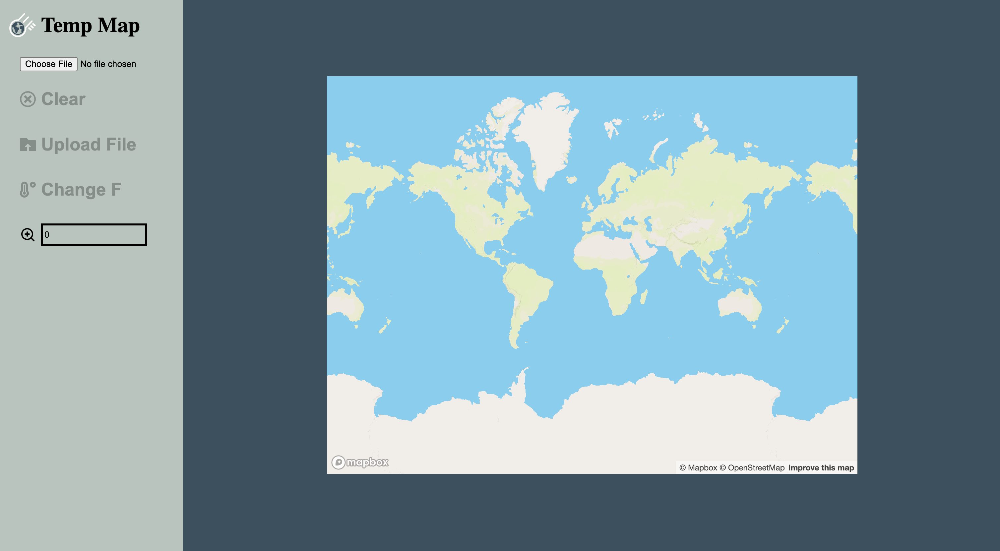

# worldmap_temp_typescript

[](https://opensource.org/licenses/MIT)

## Description

This is a website build with React.js/Typescript/Express.js/Docker-compose. It's a simplified system to show some temperatures of a number of given locations on a map. The user can uploads a data file and a map is shown with locations' temperatures according to the data. Also, user able to switch from °F to °C

## Table of Contents

- [Description](#description)
- [Installation](#installation)
- [Usage](#usage)
- [Built_With](#built-with)
- [API_Resources](#api-resources)
- [License](#license)

## Installation

```
 git clone https://github.com/ollyhite/worldmap_temp_typescript.git
```

- create a file
- open ternimal and cd the file name you created
- git clone with my repo link (can copy Installation section's first line)
- cd in the `cd worldmap_temp_typescript` file

- install node_modules and run the dev

1. run `npm run install` from root and client to install dependencies
2. rename .env.example to .env and add a correct token in .env for REACT_APP_MAP_BOX_TOKEN
   (consult map box documentation for more information on how to get the token)
3. run `npm run start:dev` to run the dev (server and client side)

- Docker

this projects supports docker through docker compose, see package.json for added docker scripts

1. run `npm run dc:up` to start the command using docker
2. visit http://localhost:8000

- npm scripts for docker compose

  - `dc:up` -- start the container (builds the container if it is not present)
  - `dc:stop` -- stop the container
  - `dc:up:build` -- rebuild and start the container
  - `dc:sh` -- start the container with a shell attached to execute commands in the container
  - `dc:ps` -- list containers

#### Uplaod JSON File Example

```
[
  {
    "city": "Fort Collins",
    "lat": "40.585258",
    "lon": "-105.084419",
    "temp": "84.2"
  },
  {
    "city": "Danver",
    "lat": "39.742043",
    "lon": "-104.991531",
    "temp": "86.0"
  },
  {
    "city": "Loveland",
    "lat": "40.398857",
    "lon": "-105.052643",
    "temp": "89.6"
  }
]

```

## Usage



## Built With

- React.js
- Typescript
- Mapbox-gl.js
- Express.js
- Dorcker-compose
- sass

## API Resources

- react-icons

## Author Info & Getting Help

- [Pei-Yun Hite's Github Link](https://github.com/ollyhite)
- Send Qquestions or suggestions for changes to the worldmap_temp_typescript project maintainer, [Pei-Yun Hite](mailto:peiyunhite@gmail.com?subject=[GitHub]%20worldmap_temp_typescript%20) , for consideration.

## License

MIT License
Copyright (c) 2022 Pei-Yun Hite
Permission is hereby granted, free of charge, to any person obtaining a copy of this software and associated documentation files (the "Software"), to deal in the Software without restriction, including without limitation the rights to use, copy, modify, merge, publish, distribute, sublicense, and/or sell copies of the Software, and to permit persons to whom the Software is furnished to do so, subject to the following conditions:
The above copyright notice and this permission notice shall be included in all copies or substantial portions of the Software.
THE SOFTWARE IS PROVIDED "AS IS", WITHOUT WARRANTY OF ANY KIND, EXPRESS OR IMPLIED, INCLUDING BUT NOT LIMITED TO THE WARRANTIES OF MERCHANTABILITY, FITNESS FOR A PARTICULAR PURPOSE AND NONINFRINGEMENT. IN NO EVENT SHALL THE AUTHORS OR COPYRIGHT HOLDERS BE LIABLE FOR ANY CLAIM, DAMAGES OR OTHER LIABILITY, WHETHER IN AN ACTION OF CONTRACT, TORT OR OTHERWISE, ARISING FROM, OUT OF OR IN CONNECTION WITH THE SOFTWARE OR THE USE OR OTHER DEALINGS IN THE SOFTWARE.

[https://choosealicense.com/licenses/mit/](https://choosealicense.com/licenses/mit/)
